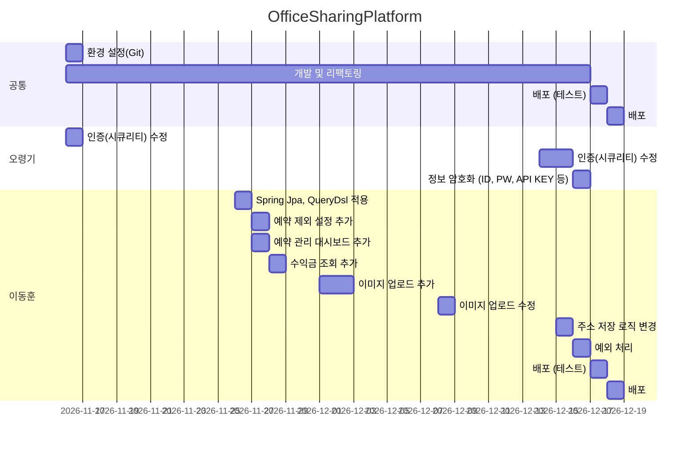

# BackOffice

## Repository for Deploying Project

### BE : 오령기, 최한성, 이동훈

### FE : 이찬형

### 개발 일정

```mermaid
gantt
dateFormat MM-DD
title OfficeSharingPlatform

    section 공통
    환경 설정(Git)             :chap1, 11-16, 1d
    개발 및 리팩토링             :chap2, 11-16, 12-17
    배포 (테스트)               :chap3, 12-17, 12-18
    배포                      :chap4, 12-18, 12-19

    section 오령기
    인증(시큐리티) 수정                : chap1, 11-16, 1d
    인증(시큐리티) 수정                : chap2, 12-14, 2d
    정보 암호화 (ID, PW, API KEY 등)  : chap3, 12-16, 1d
    
    section 이동훈
    Spring Jpa, QueryDsl 적용     : chap1, 11-26, 1d
    예약 제외 설정 추가               : chap2, 11-27, 1d
    예약 관리 대시보드 추가            : chap3, 11-27, 1d
    수익금 조회 추가                  : chap4, 11-28, 1d
    이미지 업로드 추가                : chap5, 12-01, 2d
    이미지 업로드 수정                : chap6, 12-08, 1d
    주소 저장 로직 변경                : chap7, 12-15, 1d
    예외 처리                       : chap8, 12-16, 1d
    배포 (테스트)                    : chap9, 12-17, 1d
    배포                            : chap10, 12-18, 1d

```